# ESP32 based IR AC Controller 

This project is coursework for the Embedded Systems undergraduate course @ UNIMI.  
It is designed to control AC units unidirectionally using an IR LED. Its functionality includes turning the unit on and off, setting the target room temperature, adjusting the fan speed, and selecting the operating mode. These features are accessed by navigating a menu with an encoder on a 1602 LCD.  
The controller also includes an ambient temperature sensor, which enables protective heating or cooling when the room temperature drops below 10°C or rises above 30°C.  
Additionally, it is equipped with an mmWave presence sensor (LD2410C) for automatic air conditioning based on whether people are present in the room.

## How it works

The user interface consists of a menu displayed on the 1602 LCD with five different pages. To interact with the currently displayed page, the user needs to press the encoder button. The pages are described in the following table, each with a different button click action:  
|Page|Description|Click action|
|---|---|---|
|MAIN|Displays the current AC unit state (on/off) and shows the ambient temperature and relative humidity|Toggles the AC unit state|
|MODE|Displays the currently set AC unit mode, which can be either AUTO, COOL, DRY, FAN or HEAT|Enters MODE submenu, where it's possible to select a different mode via the encoder rotation|
|SET|Displays the currently set AC unit setpoint (target ambient temperature)|Enters SET submenu, where it's possible to select a different setpoint between 16°C and 30°C via the encoder rotation in 0.5°C increments|
|FAN|Display the currently set AC unit fan speed, which can be either AUTO, HIGH, MEDIUM, LOW or QUIET|Enters the FAN submenu, where it's possible to select a different fan speed via the encoder rotation|
|PRESENCE DETECTION|Displays the current human presence detection state, which is either ON or OFF|Toggles the presence detection|

    
MAIN page

    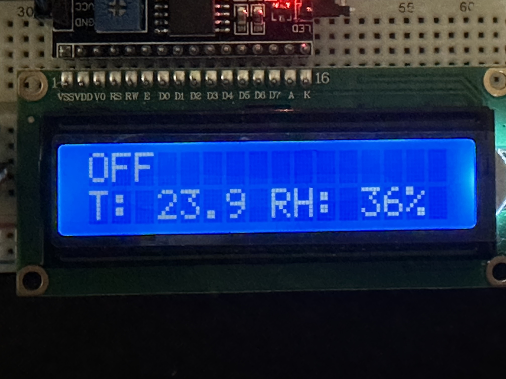
    

    
MODE page

    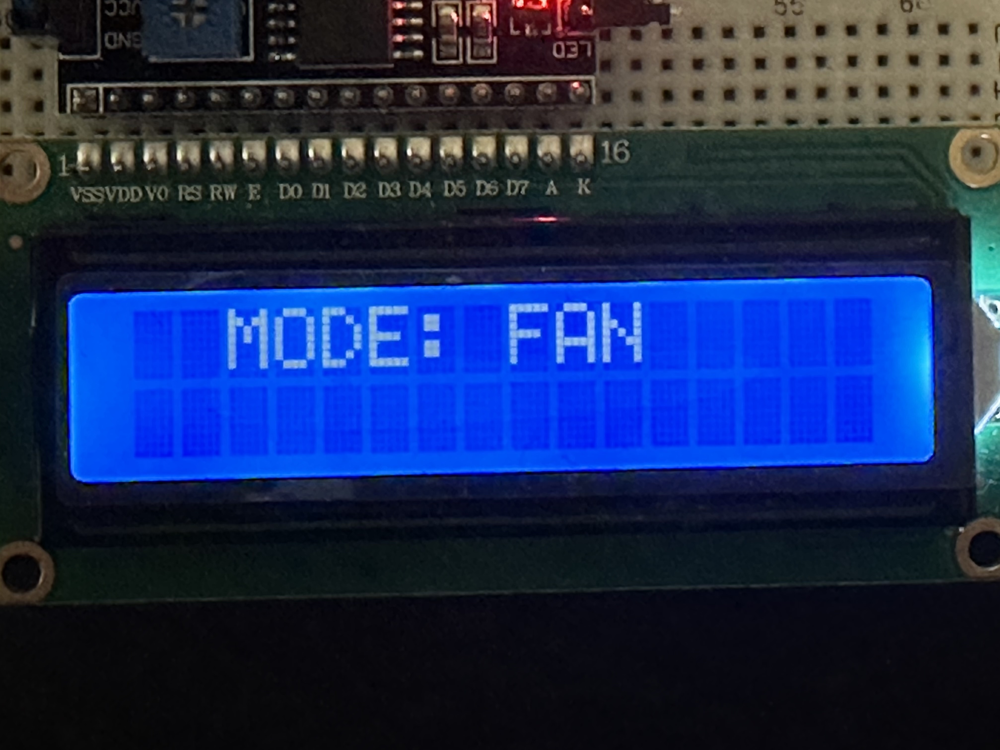
    

    
SET page

    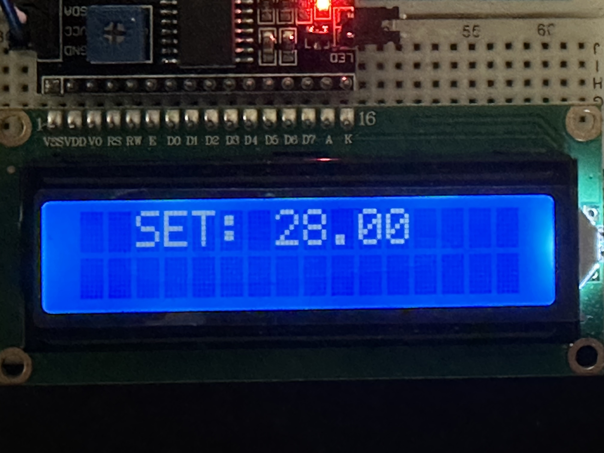
    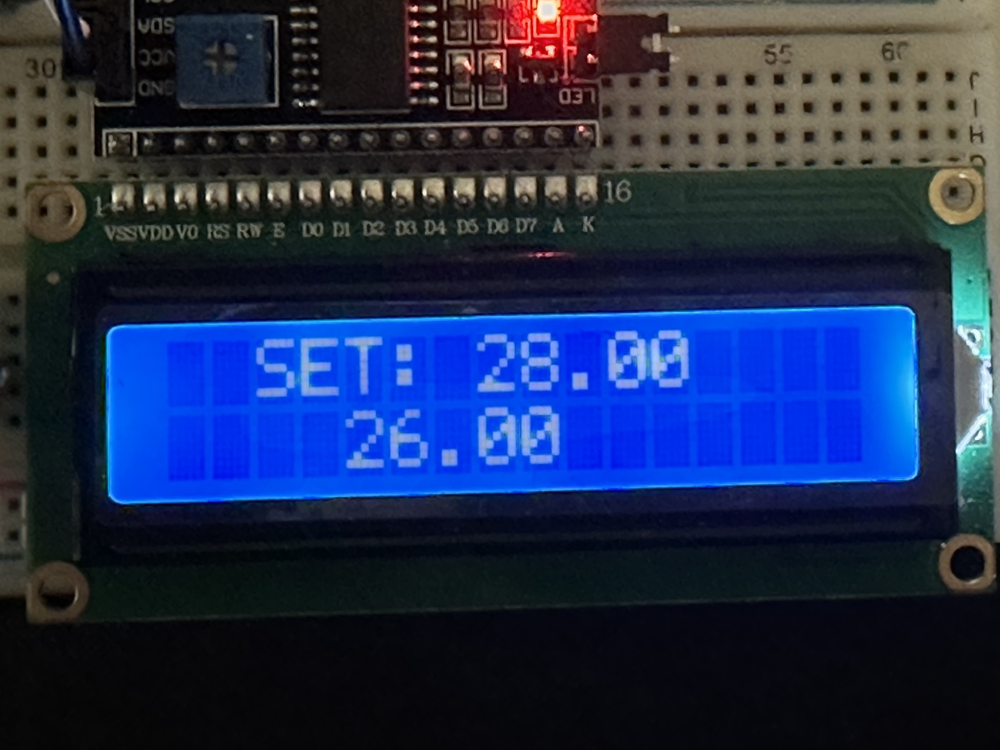

    
FAN page

    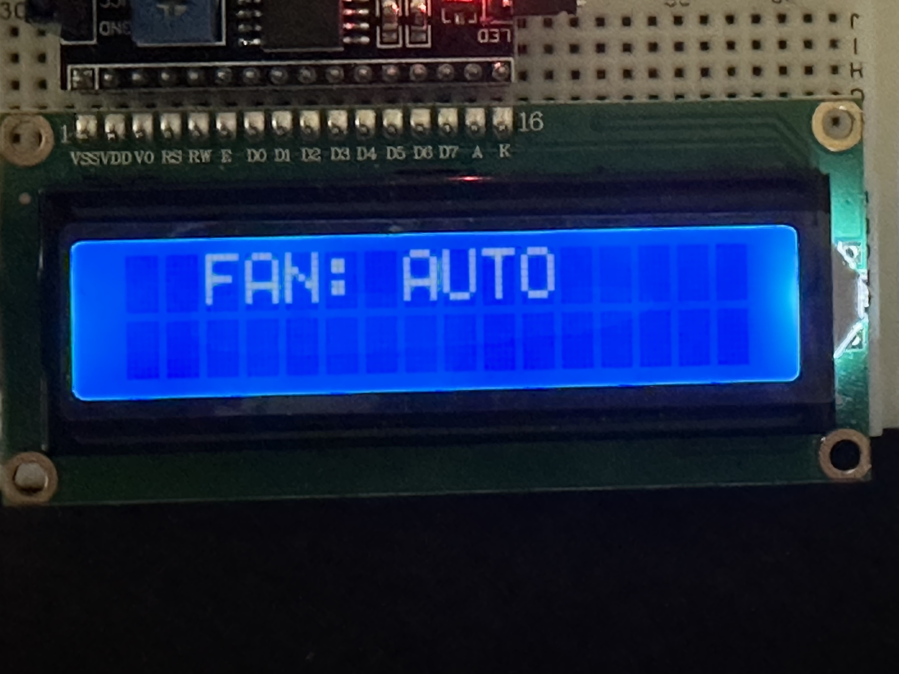
    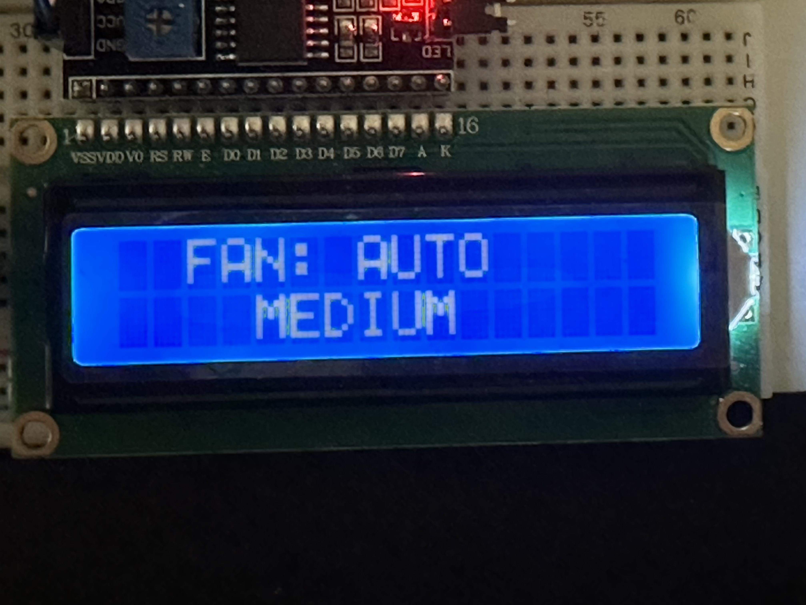

    
PRESENCE DETECTION page

    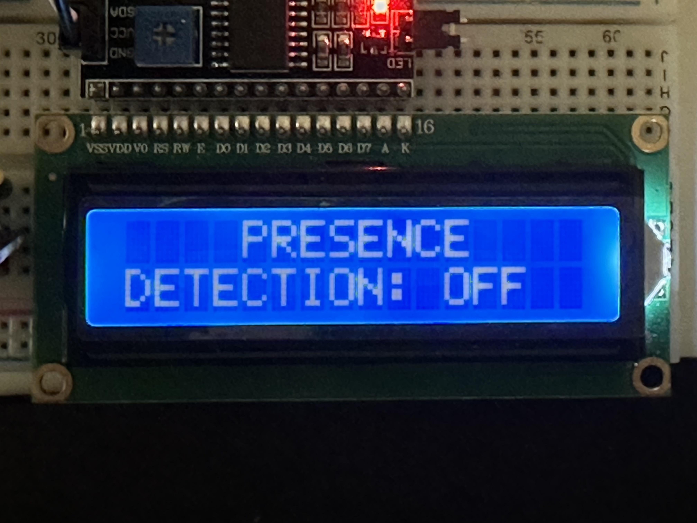
    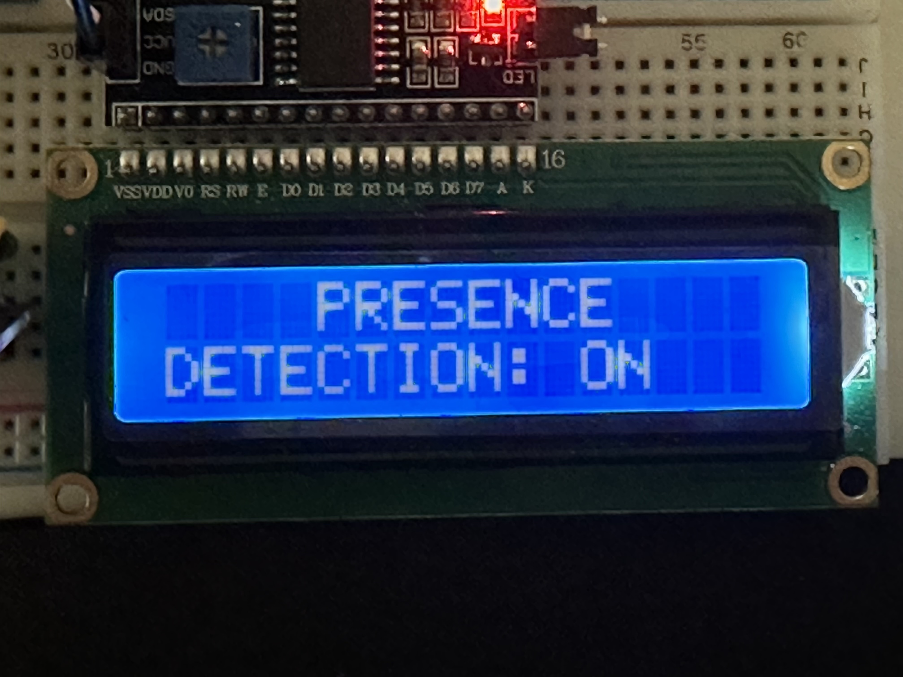

## Components

- ESP32-WROOM-32
- 940nm IR LED
- PN2222 Transistor
- DHT11 Temp and RH sensor
- KY-040 Rotary encoder
- 1602 Liquid Crystal Display
- I2C LCD-1602 Adapter/Interface
- HiLink LD2410C Human Presence Radar Module

## Schematic

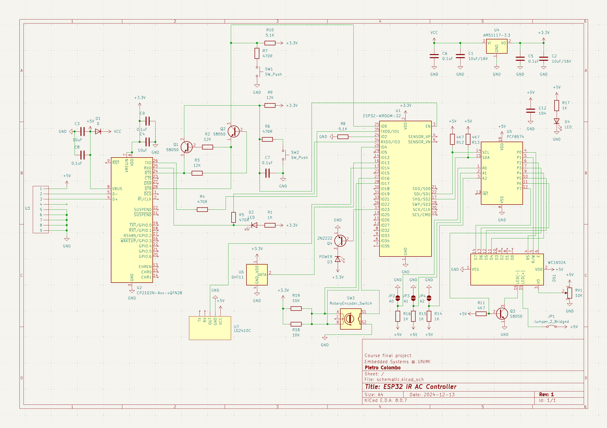

## Pictures
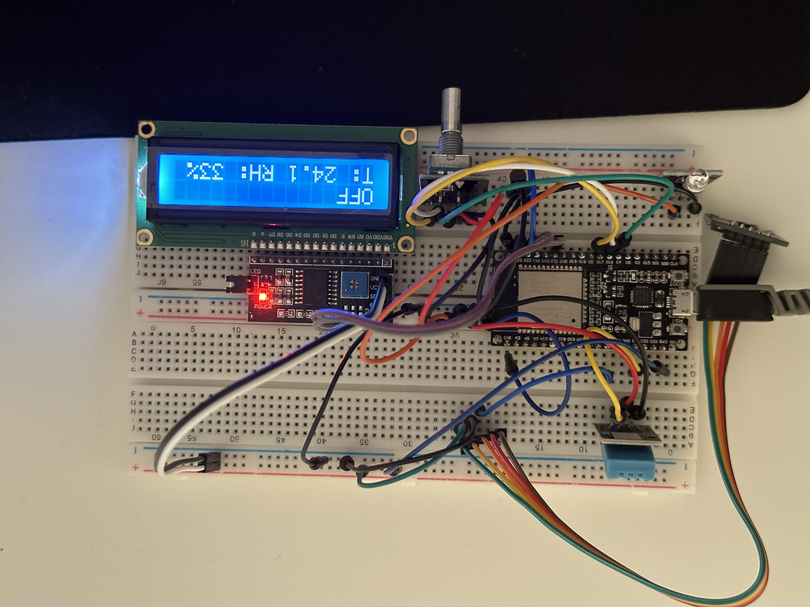
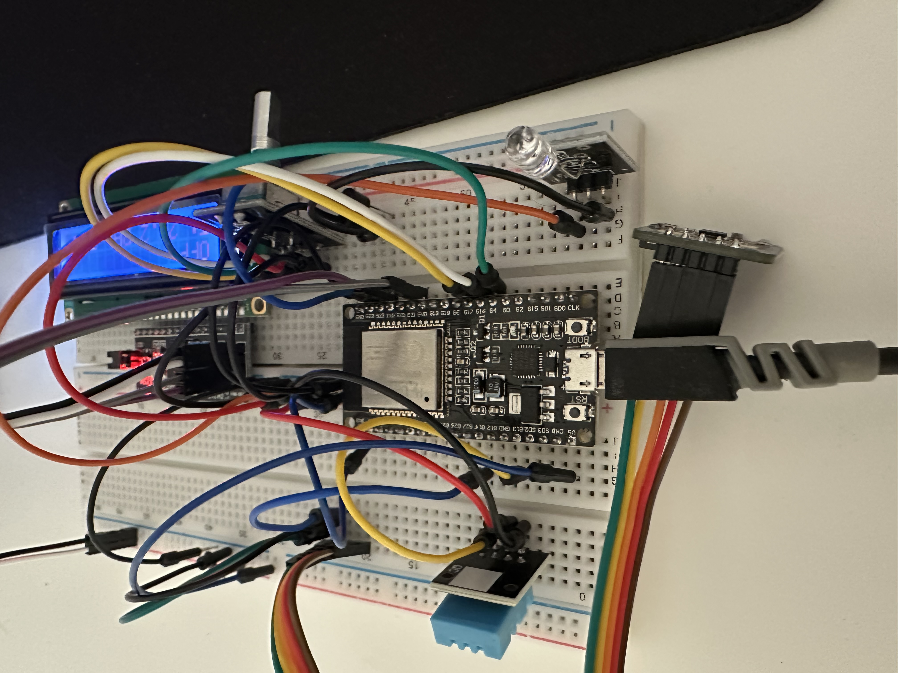
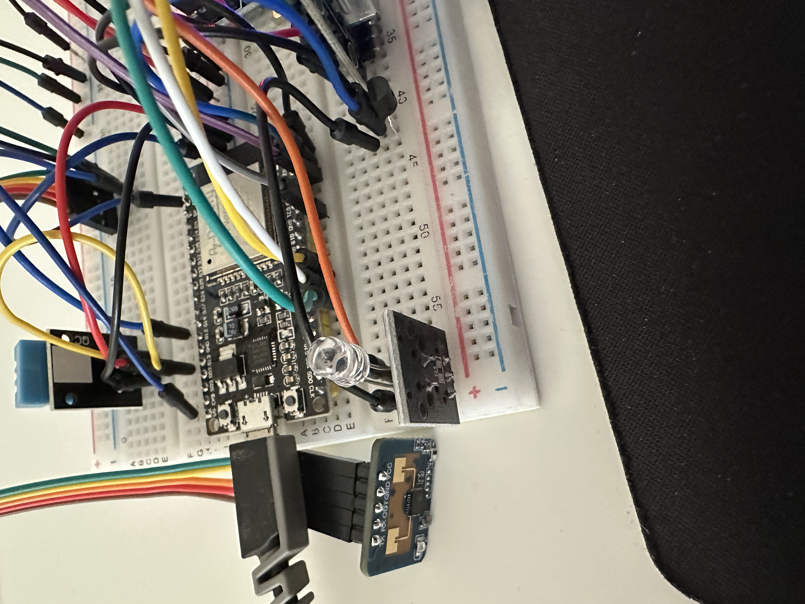

## Libraries

This project makes use of the following libraries:
- [IRremoteESP8266](https://github.com/crankyoldgit/IRremoteESP8266) by David Conran, under [LGPL-2.1](LGPL-2.1) license.
- [NewEncoder](https://github.com/gfvalvo/NewEncoder) by _gfvalvo_, under [LGPL-2.1](LGPL-2.1) license.
- [DHT-sensor-library](https://github.com/adafruit/DHT-sensor-library) by Adafruit Industries, under [MIT](MIT) license.
- [Unified Sensor Driver](https://github.com/adafruit/Adafruit_Sensor) by Adafruit Industries, under [Apache 2.0](APACHE-2.0) license.
- [LiquidCrystal_I2C](https://github.com/johnrickman/LiquidCrystal_I2C) by John Rickman.